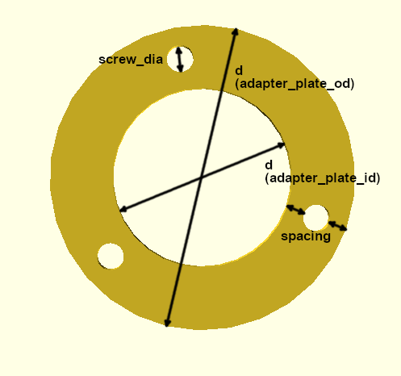

# Connectors

## Connector System

The connector system involves an [Adapter Plate](adapter_plate.scad) of a standardized shape that can be adjusted in size and bolt pattern through many OpenSCAD parameters to fit a particular spot on a model. The general shape is a circular disc with an opening in the middle and a varying number of bolt holes of appropriate size distributed evenly throughout the disc. The idea is that a feature can be generated that fits anywhere on the model where an adapter plate was placed, as long as the same parameters are used for the features as they were for the adapter plate on the model.

Adapter plates can be sized by either specifying an outside or an inside diameter, depending on which dimension constrains the size on the model. In addition to the plate itself, a "drill" object can also be generated from the same parameters to be used for placing appropriate bolt holes into a mesh itself by boolean subtraction. What follows is a brief overview of the adapter plate design and the parameters as well as their effect.

| Name           | Variable  | Default | Description                                                                                                                              |
|----------------|-----------|---------|------------------------------------------------------------------------------------------------------------------------------------------|
| Diameter       | d         | 20      | Either the inner or the outer diameter of the adapter plate, depending on if adapter_plate_id or adapter_plate_od is used.               |
| Height         | h         | 2       | The thickness of the adapter plate or the length of the drill.                                                                           |
| Spacing        | spacing   | 2       | Space between screw holes and adapter edges.                                                                                             |
| Screw Diameter | screw_dia | 3       | Diameter of screw holes. It is generally advisable to keep this a bit below the actual screw size for a good fit, e.g. 2.8 for M3 bolts. |
| Screw Number   | screw_num | 3       | Number of screw holes evenly distributed across the plate. It is not advisable to drop this number below 3 unless space is tight.        |

## Adding - Airway End

This guide is about how to add a connector an open airway ending after a cut - it directly picks up from ["Preparation - Cutting"](../preparation/#cutting).

        - Measure Diameter, plug in for adapter of appropriate ID
        - Import, place and join adapter mesh (for join: select airways, then adapter)
        - Bisect upper geometry of airway to appropriate height
        - Clean up geometry (inner faces of adapter, outer shell of airway geometry up until bisection)
        - Select (alt+click) and Fill Edge Loops (alt+f)

## Adding - Airway Side

        - Select a roughly circular outside geometry (circle select)
        - Scale, <axis>, 0 (Flatten)
        - Grab, <axis>, move until at appropriate position
        - Generate and diff. appropriately sized drill
        - Insert, rotate, place, add boolean mod to airways