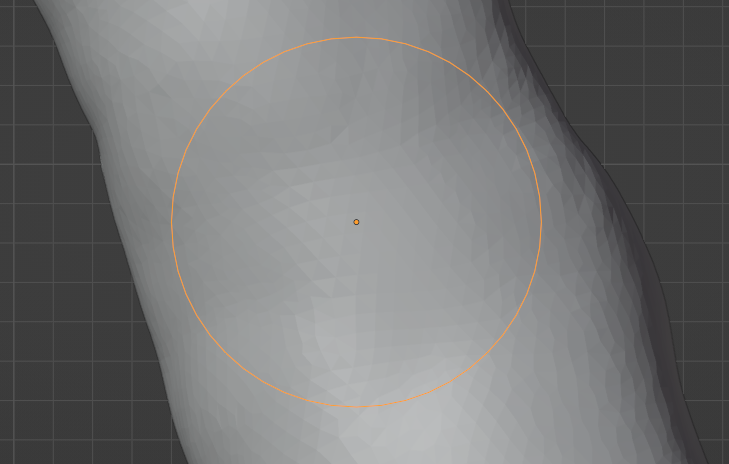

# Connectors

## Connector System

The connector system involves an Adapter Plate (adapter_plate.scad) of a standardized shape that can be adjusted in size and bolt pattern through many OpenSCAD parameters to fit a particular spot on a model. The general shape is a circular disc with an opening in the middle and a varying number of bolt holes of appropriate size distributed evenly throughout the disc. The idea is that a feature can be generated that fits anywhere on the model where an adapter plate was placed, as long as the same parameters are used for the features as they were for the adapter plate on the model.

Adapter plates can be sized by either specifying an outside or an inside diameter, depending on which dimension constrains the size on the model. In addition to the plate itself, a "drill" object can also be generated from the same parameters to be used for placing appropriate bolt holes into a mesh itself by boolean subtraction. What follows is a brief overview of the adapter plate design and the parameters as well as their effect.

| Name           | Variable  | Default | Description                                                                                                                              |
|----------------|-----------|---------|------------------------------------------------------------------------------------------------------------------------------------------|
| Diameter       | d         | 20      | Either the inner or the outer diameter of the adapter plate, depending on if adapter_plate_id or adapter_plate_od is used.               |
| Height         | h         | 2       | The thickness of the adapter plate or the length of the drill.                                                                           |
| Spacing        | spacing   | 2       | Space between screw holes and adapter edges.                                                                                             |
| Screw Diameter | screw_dia | 3       | Diameter of screw holes. It is generally advisable to keep this a bit below the actual screw size for a good fit, e.g. 2.8 for M3 bolts. |
| Screw Number   | screw_num | 3       | Number of screw holes evenly distributed across the plate. It is not advisable to drop this number below 3 unless space is tight.        |

## Adding - Airway End

This guide is about how to add a connector an open airway ending after a cut - it directly picks up from ["Preparation - Cutting"](../preparation/#cutting).

The very first thing to do is to determine the size (and other parameters) for the adapter.
Position the view so it's looking directly at the open end. Select a segment object and switch into Edit mode. Select the Measure  tool on the left side. Hold the ++ctrl++ key, move the mouse over an outer vertice, click and drag the measurement to a vertice on the opposite side. If you're adding a connector that's supposed
to connect two airway segments, make sure to measure the other side of the cut as well. 

!!!info
    You can safely ignore the units displayed here (m). Blender, same as OpenSCAD, doesn't really know anything about units and just deals in numbers. The scale is usually mm.

Choose the largest out of all the measurements, add 5mm or so of tolerance to it and use that as the inner diameter (d) for the adapter plate. Decide on the other parameters based on the descriptions above. Open adapter_plate.scad in OpenSCAD, change the parameters, click  or press ++f6++ to render the model. Verify everything looks in order and click  or press ++f7++ to save the adapter plate an STL file. Save it somewhere safe, preferably not your recycle bin. Document the chosen parameters for the adapter plate and its location (segment, etc.) so you can later generate appropriate features.

Go back to Blender and click File -> Import -> Stl. Select the adapter plate. Use the grab (++g++ + Axis key) and rotate (++r++ + Axis key) tools to align the top of the plate with the end of the airway mesh. This is easiest if
you move the plate into rough position and then switch to a side view using the axis selector on the top right. Perform final alignment by hand.

!!! info
    There are more precise ways to align in Blender but they take more time and this
    method was found to provide more than adequate accuracy if executed properly. If you're not comfortable
    doing this by hand, research the Blender "Align Objects" tool. You'll want to select the edges at the cut, set
    the 3D cursor to the selection and then align by the cursor.

Select the airway segment object, enter Edit mode and use the circle select tool (++c++) to select only the outer airway geometry around the adapter plate. There isn't really a harm if you hit some of the inner mesh here as well, but it will make the mesh slightly less clean and weigh on your conscience.

Switch to the same view you used for aligning, select the Bisect tool (Mesh -> Bisect) and drag a line across the bottom of the adapter object. In the Bisect options, make sure "Fill", "Clear Inner" and "Clear Outer" are deselected.

This should create a set of nice straight edges on the airway that are in line with the bottom of the adapter plate. Switch to Face Mode  on the top left and use the circle tool (++c++) to select all the outer airway geometry above the bisection line. This time, be careful not to hit any inside mesh - you can deselect with the circle tool by hitting the middle mouse button.

Hit ++x++ and click "Faces" to delete the appropriate geometry. Next, the inside geometry of the adapter plate
has to go. In object mode, select the adapter plate object, then switch back into Edit Mode. Use the same method as
before to select and delete the inner edges of the plate.

Now, all that is left to do is connect the lower and upper edges of the prepared meshes. First, they have to be
made into one object in Blender. Switch into Object Mode, select the adapter plate, hold ++ctrl++ and select the airway mesh - the order is important. Click Object->join or hit ++ctrl+j++ to join the objects. Switch back into Edit Mode.

Switch into Edge Mode , hold the ++alt++ key and left click an edge on the top of the upper inner airway geometry to select the whole ring. Hold ++alt++ and ++shift++ and left click an edge on the upper inner side of the adapter.

Hit ++alt+f++ to automatically join the meshes in Blender. Perform the same procedure for the two lower edges.

!!!info
    If the process results in a weird join (it fills the middle of the airway as well) or the edge loop select fails, make sure you didn't forget to delete a face in one of the previous steps. An example of this mistake is illustrated below.

    

You should end up with a cleanly joined adapter plate after this. Repeat the same process for the other end if this is a middle cut, make sure to use the same parameters for the plate.

## Adding - Airway Side

The add a spot to screw an adapter into the side of the model, you'll need to make a circular cut on the side
of the airway geometry and then generate a "drill" for an adapter plate which will be boolean-joined to the mesh.

Start in Object Mode, hit ++shift+a++ and select "Curve" then "Circle". This will create a circle object. Use
the grab, rotate and scale tools to place it roughly in front of the geometry where you want the connector. Then, change the view so the circle perfectly displays where you want it to be on the mesh - the tool we're about to use
works by projecting this circle onto the mesh based onto that perspective. You can click an appropriate axis on the
top right to switch into a perfect side view and align the circle based on that, if you want.

Now, in the object panel, select the circle, hold ++ctrl++ and then select the airway segment.

Switch into Edit Mode and click Mesh -> Knife Project. This should create a perfect circular cut on the side of the airway and select the appropriate mesh for you. Determine the axis the faces are most perpendicular to by looking at the axis display on the top right and hit ++s++ + the axis key + ++0++ to flatten the circle out perpendicular to that axis. Now, use the Grab (++g++) and Rotate (++r++) tools to position the flat area appropriately.

elect the Measure Tool , hold ++ctrl++ and drag a line across the circle to measure its diameter. Open adapter_plate.scad and use adapter_drill_od with this as the d parameter to generate a drill with this as its d-parameter. Document the parameters used and location of this connector spot. Switch back into object mode and import this object into Blender.

!!!info
    If space is extremely tight (for example on a child's airway) you might consider setting screw_count to 0 to eliminate screws, generating just a drill for the center with an appropriate margin to the side and then gluing a separately printed adapter plate to the model.

Place the object so it "drills" into the side of the model at the flat face. Make sure it doesn't touch the other side of the airway.

Select the airway segment object, click "Modifiers"  on the bottom right. Click "Add Modifier", select "Boolean". Make sure "Difference" is selected, Operand Type is "Object" and choose the drill object for "Object". If you hide the drill object (the eye  icon) you can see how this operation is going to look.

If you're satisfied, click the little arrow next to the camera on the modifier and "Apply".

This model is now ready to accept a connector on the side!