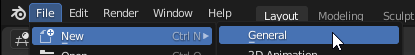
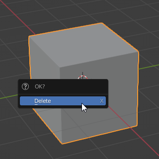
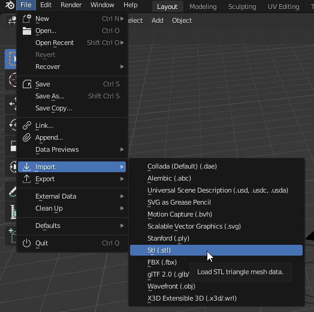
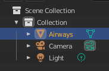
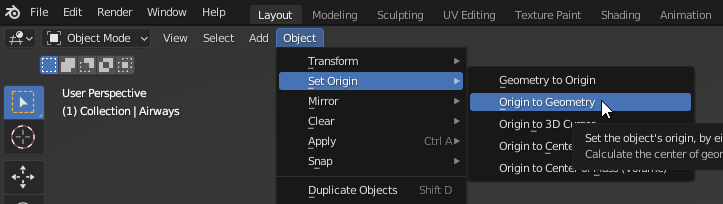
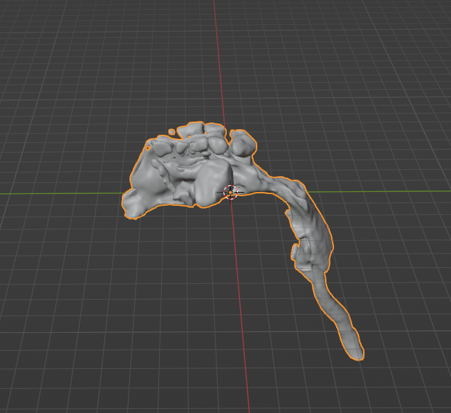

# Importing

## Creating a blank scene

Open up a blank blender scene by opening up a new window or clicking File -> New -> General.

Delete the default cube by selecting it with a left-click and hitting the "X" key, confirming with a left click on "Delete" or hitting Enter.

You're now ready to toy with airway geometry.

## Importing the STL from slicer

To import the file exported from 3D Slicer as described in [Export](), click File -> Import -> STl (.stl).

Navigate to the exported STL file and double click it. An object named after the file should appear in the top right scene overview.

You probably won't see the airway geometry in the scene yet. This is because 3D Slicer messes up the origin point of the model - the geometry exists, it is just far out of view. 

The origin point of the model can be fixed by using a Blender function called "Origin to geometry" to have Blender recalculate it. With the model selected on the top right, click Object -> Set Origin -> Origin to Geometry to the top left of the 3D view.

Now that the origin point is fixed, the geometry can be moved to the coordinates 0,0,0 to center it in the scene. One way to
do this is to set the 3D Cursor of Blender to that so called "world origin" and then moving the geometry to the cursor.
With the model selected, hit ++shift+s++ to bring up the cursor menu and click "Cursor to World Origin". Then, hit ++shift+s++
again and click "Selection to Cursor". Your geometry should now be visible at 0,0,0 and ready to be edited.

!!! info
    If you want you can move it around to make it easier to work with. Objects in Blender can be moved by hitting the ++g++ key (remember: "grab"), moving the mouse and then confirming with a left click. If you add another key for an axis after the "G" key you only move the object on that axis. For example, you can hit ++g+z++ to move the model vertically, move the mouse up or down and confirm with a left click.
