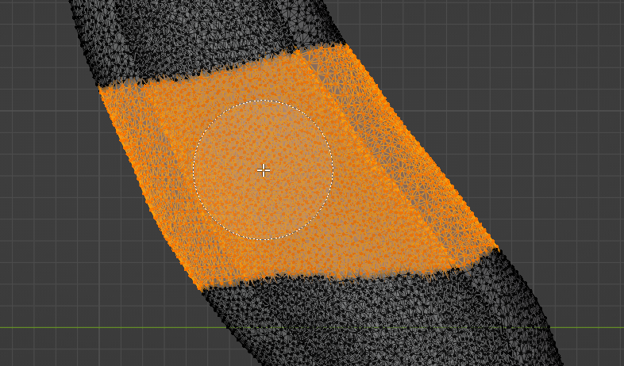

# Preparation

## Hollowing

The Object modifier "Solidify" is used to hollow out the solid airway mesh. Make sure that object mode
is selected on the top left of the interface. Then, select the airway mesh and switch to the
modifiers by clicking the little blue wrench icon on the vertical row of items on the lower right pane. Select "Add Modifier",
then "Solidify". 

!!! info
    In order to best see the results, it is advised to switch to Wireframe view mode.  
    (Standard Key: ++z++ + Click on "Wireframe")

Select an appropriate (TODO: What is appropriate?) thickness for the model and printing method. For further steps,
it is recommended to apply the modifier, which makes its changes to the model permanent. You can choose File->Save Copy before
doing that to create a backup vanilla state of the model.

The result should look something like this:

## Cutting

For easier handling and printing, the airway geometry is best split up into multiple parts that are printed separately
and later connected again. This is accomplished using Blender's "Bisect" tool.

To start with, the airway geometry needs to be selected and Blender needs to be in "Edit Mode". Select the model on the top right or by clicking on it in the scene and then switching to "Edit Mode" on the top left.

Clear any existing mesh selections by hitting ++alt+a++. Move the camera to the area you want cut and select all of the geometry around the cutting area. Hit "C" to enable a selection brush. You can adjust its size by using the mousewheel, select using the left mouse button and undo selections with the middle mouse button. You can cancel the mode by hitting the right mouse button. Move around the geometry multiple times and make sure all nooks and crannies are selected. 

!!! info
    If you want, you can enable "X-Ray" mode on the top right to allow selecting through solid geometry, but be careful with this as you might easily hit geometry you did not intend to.

!!!warning
    Since Bisect cuts by using an infinite plane, make sure you do not accidentally select any geometry areas you do not want modified, but make sure to not forget to select any hidden spots.

With the geometry selected, click Mesh -> Bisect on the top left.

Drag the cutting plane over the selected geometry as desired.

Pop up the little "Bisect" window on the bottom left to adjust the parameters. Make sure "Fill", "Clear Inner" and "Clear Outer" are deselected. You can play with the Plane Point and Normal if you're not quite happy with the way the cut is
oriented.

Now hit ++v++ ("Rip") and click the right mouse button to tear the geometry apart. Then, hit ++ctrl+l++ to select one of the meshes. Move the geometry away a little bit to give yourself more room to work with.

