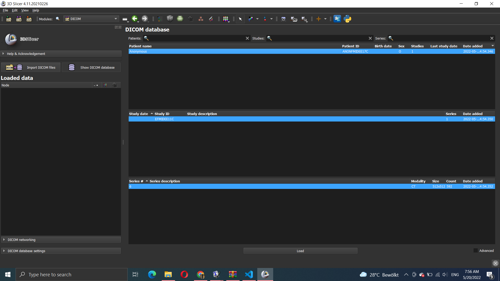

# Loading Data

## DICOM

Open the 3D Slicer. Figure below shows the first window
that opens when you start this software.

After this, you press LOAD DICOM FILES and important data in DICOM format.
Now you have to click SHOW DICOM and choose appropriate slice and click LOAD,
see figure.

After this you will have the following windows, see figure.

