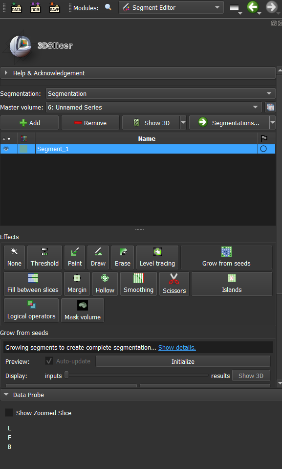
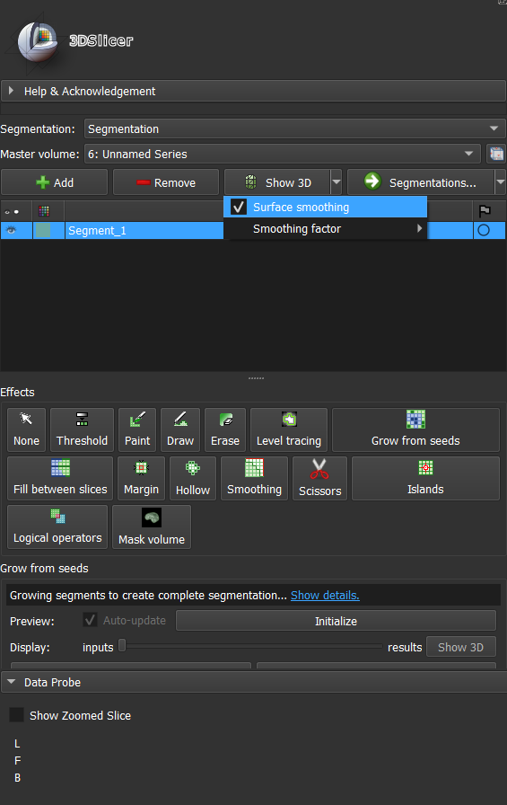

# Airway Segmentation

We are ready to segment! Now, we have to start with different layers.
Usually, we have to choose 3 layers - Background, airways and second background.
In order to start doing our segmentation, we click “Add”, then we have to double click
on the name that apperaded, and rename that to the respective layer, in our case, we
start with the background.

Now, we have to choose the “Threshold” option in the effects (this can be seen on
figure 4). It is very important that we choose an appropriate threshold, so that it does
not cover the unwanted region (airways). There isn't a set range that has to be
chosen during the threshold of the background, however it is usually between -300 to
-400. Once we choose an appropriate range, we have to click “use for masking”.

Once an appropriate threshold was chosen, we had to click the “paint” button and
start selecting the region of the background (basically around the airways). In order
to get a decent resulting model that is similar to an actual anatomic structure of the
human, it is better to perform this procedure on numerous slides (20-30). Note that
the painting has to be performed on the first window out of 4.

After that, we have to repeat step 7- adding background and create Airways
background. Note that down below in the list we have to choose option “Outside of
all visible segments”- this will allow us NOT to paint the unwanted region that was
previously selected in the background layer.

Unfortunately, sometimes, areas like the nose are not closed, in order to improve the
resulting model, we may additionally use a second background layer that will close
these regions and improve the resulting model.

Frankly speaking, we are done with selecting the areas of interest, and we are set to
make up the model! In order to do so, we have to choose the “grow from seeds
option”, this can be seen on the figure.

Down below we should choose - initialize button. This might take some time,
depending on the computer's performance.

After this is done, we have to click the SHOW 3D button- note that WE HAVE TO
DESELECT SURFACE SMOOTHING. This can be seen on figure. In order to see
the airways only, we have to make this layer visible (other layers have to be set to
invisible)

Now, our model is finally ready! In order to improve the model, we have to get rid of
some unwanted fragments of our model. In order to perform this procedure Once this
option is chosen, by default it gives us a freeform option of cutting. This is helpful, but
sometimes, we can also choose a circle. e“Scissors” have to be chosen in the effect
that the resulting model can be adjusted by cutting out the unwanted fragments/parts.